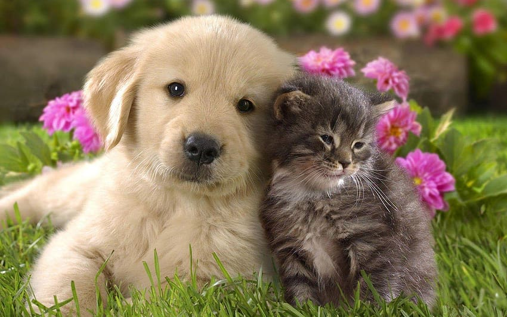

# Sitio Web de Adopción de Mascotas "Huellas de Esperanza"

## 1. Título y Descripción del Proyecto:
- **Título:** 🐾 Huellas de Esperanza – Adopción de mascotas
**Huellas de Esperanza** es un sitio web desarrollado con el objetivo de facilitar la adopción y tránsito de perros y gatos. La plataforma está diseñada para conectar a personas interesadas en adoptar mascotas o ofrecer hospedaje transitorio hasta su adopción final.

## Descripción del Proyecto
**Huellas de Esperanza** es un sitio web desarrollado con el objetivo de facilitar la adopción y tránsito de perros y gatos. La plataforma está diseñada para conectar a personas interesadas en adoptar mascotas o ofrecer hospedaje transitorio hasta su adopción final.

## Público Objetivo
- Personas interesadas en adoptar mascotas como miembros de su familia.
- Personas interesadas en ofrecer hospedaje transitorio a mascotas.

## Estructura del Sitio
- **Inicio**
- **Sobre Nosotros**
- **Adoptar**
  - **Perros**
  - **Gatos**
  - **Tránsito**
- **Donar**
- **Contacto**
- **Listado de Adoptantes**
- **Agregar Mascotas**
- **Registro y Login**

## Diseño y Estilo
- **Estilo visual:** Amigable, tierno, inspirador, alegre.
- **Colores:** Tonos de verde.
- **Tipografía:** Fuente relajada para una lectura fácil y agradable.

## Contenido y Funcionalidades
- **Contenido:** Información detallada sobre las mascotas disponibles para adopción o tránsito.
- **Funcionalidades:**
  - Formulario de adopción.
  - Fotos y descripciones de animales disponibles.
  - Opción de donación.
  - Información de contacto.
  - Registro y login de usuarios.
  - Listado de adoptantes.
  - Agregar y eliminar mascotas.

## Integrantes del Equipo
- Sabrina Cortez
- Adrian Recio
- Jesica Gomez
- Nicolas Naggi

## Cronograma Tentativo
- **Diseño y planificación:** 2 semanas
- **Desarrollo y programación:** 4 semanas
- **Creación de contenido:** 2 semanas

## Recursos Externos
- Integración de Bootstrap para formularios y carruseles.
- Uso de un framework de mapas para agregar ubicación en la información de contacto.
- Videos de concientización sobre la adopción de mascotas con enlaces externos.

## Desarrollos Futuros y Mejoras Potenciales
- **Calendario de Eventos:** Incluir un calendario para mostrar eventos importantes como ferias de adopción o actividades relacionadas con mascotas.
- **Galería de Adoptantes Felices:** Sección donde los adoptantes pueden compartir fotos y testimonios de sus nuevas mascotas.
- **Publicidad para Patrocinantes:** Sección para publicitar marcas o locales que deseen contribuir con gastos, insumos o atenciones veterinarias.

## Fecha de Entrega
- 17/07/24